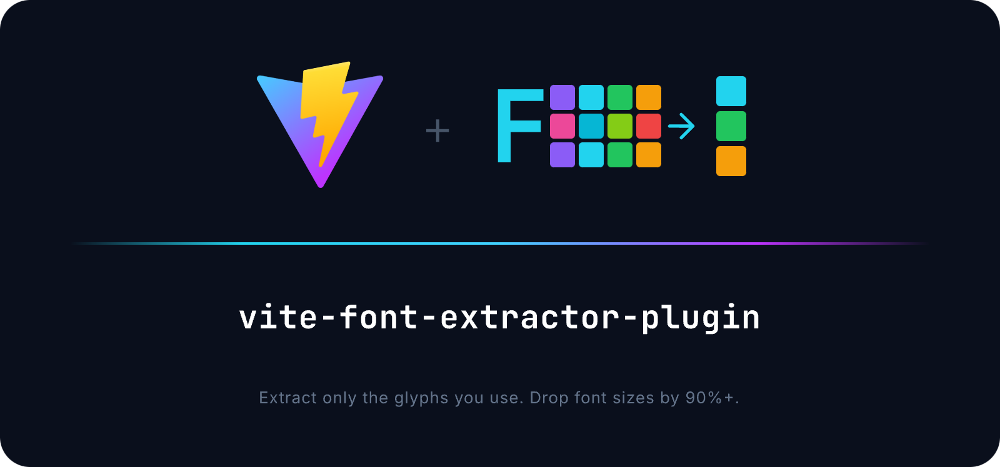

<p align="center">
  
</p>

<p align="center">
  
  
  
  
</p>

# vite-font-extractor-plugin

Plugin de Vite que **extrae únicamente los glifos que utilizas** de los archivos de fuentes: fuentes de iconos, fuentes de texto o ambas. Soporta Vite 5, 6, 7 y 8.

```
Antes:  Material Icons   348 KB (todos los 2,000+ iconos)
Después: Material Icons    12 KB (solo los 3 iconos que necesitas)   → 97% más pequeño
```

## Características

- **Minificación de fuentes de iconos** — conserva solo las ligaduras que utilices (Material Icons, FontAwesome, etc.)
- **Subsetting de fuentes de texto** — conserva solo caracteres específicos mediante la consulta `?subset=`
- **Modo automático sin configuración** — detecta glifos de `content: "..."` en CSS automáticamente
- **Optimización de Google Fonts** — añade el parámetro `&text=` para el subsetting del lado del servidor
- **Funciona en build y dev** — minifica las fuentes sobre la marcha durante el desarrollo
- **Soporte para Vite 5–8** — compatible con los bundlers Rollup y Rolldown
- **Hashing basado en contenido** — los nombres de archivo de salida cambian cuando cambia la configuración (seguro para caché)
- **[Playground en vivo](https://a3mitskevich.github.io/vite-font-extractor-plugin/)** — ve el plugin en acción
- **Caché de disco** — evita la re-minificación en compilaciones repetidas

## Inicio Rápido

```bash
npm install vite-font-extractor-plugin
```

### Sin configuración (modo automático)

```js
// vite.config.js
import FontExtractor from 'vite-font-extractor-plugin'

export default defineConfig({
    plugins: [FontExtractor()],
})
```

El plugin escanea todo el CSS en busca de declaraciones `content: "..."`, recolecta los glifos referenciados y elimina todo lo demás de los archivos de fuentes.

### Modo manual

Especifica exactamente qué iconos conservar:

```js
FontExtractor({
    type: 'manual',
    targets: [
        {
            fontName: 'Material Icons',
            ligatures: ['close', 'menu', 'search', 'home'],
        },
    ],
})
```

## Subsetting de Fuentes de Texto

Elimina los caracteres no utilizados de fuentes de texto como Roboto, Inter o Open Sans.

### Vía consulta CSS `?subset=`

```css
/* Conservar solo letras latinas y dígitos */
@font-face {
    font-family: 'Roboto';
    src: url('./fonts/Roboto.woff2?subset=ABCDEFGHIJKLMNOPQRSTUVWXYZabcdefghijklmnopqrstuvwxyz0123456789') format('woff2');
}

/* Conservar un rango Unicode (ej. Cirílico) */
@font-face {
    font-family: 'Roboto';
    src: url('./fonts/Roboto.woff2?subset=U+0400-04FF') format('woff2');
}

/* Combinar caracteres y rangos Unicode */
@font-face {
    font-family: 'Roboto';
    src: url('./fonts/Roboto.woff2?subset=ABC,U+0400-04FF') format('woff2');
}
```

### Vía importación de JS

Útil para la carga de fuentes en tiempo de ejecución (Rive, Canvas, generadores de PDF):

```js
import fontUrl from './fonts/Roboto.woff2?subset=ABCabc'

// fontUrl es una URL limpia al asset de la fuente con subsetting
rive.load({fonts: [fontUrl]})
```

### Vía configuración del plugin

```js
FontExtractor({
    type: 'manual',
    targets: [
        {
            fontName: 'Roboto',
            characters: 'ABCabc0123456789',
            engine: 'subset',
        },
    ],
})
```

## Google Fonts

El plugin añade `&text=` a las URLs de Google Fonts, permitiendo que los servidores de Google realicen el subsetting:

```html

<link href="https://fonts.googleapis.com/icon?family=Material+Icons" rel="stylesheet">
```

```css
@import "https://fonts.googleapis.com/icon?family=Material+Icons";
```

Se admiten URLs de múltiples familias: `family=Material+Icons|Roboto`.

## Caché

Habilita la caché de disco para evitar la re-minificación cuando las fuentes y la configuración no hayan cambiado:

```js
FontExtractor({
    type: 'manual',
    targets: [{fontName: 'Material Icons', ligatures: ['close']}],
    cache: true,              // cachea en node_modules/.font-extractor-cache
    // cache: './my-cache',   // o una ruta personalizada
})
```

La caché se limpia automáticamente cuando `cache` se establece en `false`.

## Compatibilidad con Vite

| Vite | Estado       |
|------|--------------|
| v5   | Estable      |
| v6   | Estable      |
| v7   | Estable      |
| v8   | Experimental |

> Vite 8 utiliza Rolldown en lugar de Rollup. La minificación de fuentes de iconos funciona totalmente. La funcionalidad `?subset=` tiene limitaciones conocidas; consulta el [ROADMAP](./ROADMAP.md) para más detalles.

## Referencia de la API

```typescript
import FontExtractor from 'vite-font-extractor-plugin'

FontExtractor(options?: PluginOption): Plugin
```

### PluginOption

| Opción     | Tipo                                      | Predeterminado | Descripción                               |
|------------|-------------------------------------------|---------------|-------------------------------------------|
| `type`     | `'auto' \| 'manual'`                      | `'auto'`      | Estrategia de detección de glifos          |
| `targets`  | `Target \| Target[]`                      | —             | Fuentes a procesar. Requerido en modo manual |
| `cache`    | `boolean \| string`                       | —             | Habilitar caché de disco (o ruta personalizada)|
| `logLevel` | `'info' \| 'warn' \| 'error' \| 'silent'` | Config Vite   | Verbosidad del log                        |
| `apply`    | `'build' \| 'serve'`                      | ambos         | Restringir a modo build o dev             |
| `ignore`   | `string[]`                                | —             | Nombres de fuentes a omitir completamente   |

### Target

| Opción           | Tipo                 | Descripción                                      |
|------------------|----------------------|--------------------------------------------------|
| `fontName`       | `string`             | Debe coincidir con `font-family` en CSS (sin comillas)|
| `ligatures`      | `string[]`           | Nombres de iconos a conservar (ej. `['close', 'menu']`) |
| `raws`           | `string[]`           | Caracteres Unicode brutos a conservar             |
| `characters`     | `string`             | Cadena de caracteres para subsetting de fuentes de texto |
| `unicodeRanges`  | `string[]`           | Rangos Unicode (ej. `['U+0400-04FF']`)           |
| `engine`         | `'icon' \| 'subset'` | `icon` para fuentes de iconos, `subset` para fuentes de texto |
| `withWhitespace` | `boolean`            | Incluir glifos de espacio en blanco (por defecto: `false`) |

## Resolución de Problemas

**¿La fuente no se está minificando?**

- Verifica que `fontName` coincida exactamente con el valor de `font-family` en tu `@font-face` de CSS (sin comillas).
- Asegúrate de que la fuente no esté en la lista de `ignore`.

**Advertencia: "has no minify options"?**

- El plugin encontró un `@font-face` pero la fuente no está en `targets`.
- Las fuentes con URLs `?subset=` no disparan esta advertencia; se procesan automáticamente.
- Para silenciarlo: añade la fuente a `targets`, usa `?subset=`, o añádela a `ignore`.

**¿La URL de Google Font no se transformó?**

- Usa espacios en `fontName`: `'Material Icons'`, no `'Material+Icons'`.

**¿El modo automático omite glifos?**

- El modo automático solo detecta glifos de las propiedades CSS `content: "..."`.
- Si los iconos se referencian por nombre de clase o JS, utiliza el modo `manual` en su lugar.

## Licencia

[MIT](./LICENSE)

## Contribución

Las incidencias y los pull requests son bienvenidos en [GitHub](https://github.com/a3mitskevich/vite-font-extractor-plugin).
