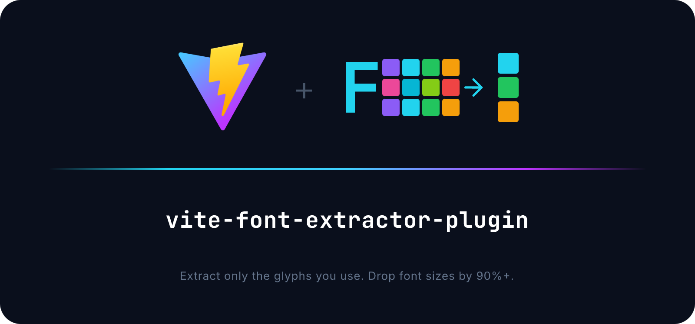

<p align="center">
  
</p>

<p align="center">
  
  
  
  
</p>

# vite-font-extractor-plugin

Drop-in Vite plugin that **extracts only the glyphs you actually use** from font files and replaces the originals with minimized versions. Works with local fonts and Google Fonts, in both `build` and `dev server` modes.

```
Material Icons (full)     →  348 KB
Material Icons (3 icons)  →   12 KB   (~97% smaller)
```

## Quick Start

```bash
npm install vite-font-extractor-plugin
```

```js
// vite.config.js
import FontExtractor from 'vite-font-extractor-plugin'

export default defineConfig({
  plugins: [
    FontExtractor() // zero-config: auto-detects used glyphs
  ],
})
```

That's it. The plugin scans your CSS for `content: "..."` declarations, figures out which glyphs are referenced, and strips everything else from font files.

## Vite Compatibility

| Vite | Status       |
|------|--------------|
| v5   | Stable       |
| v6   | Stable       |
| v7   | Stable       |
| v8   | Experimental |

> **Vite 8 note:** Icon font minification works. `?subset=` feature has known limitations with Rolldown's asset handling — see [ROADMAP](./ROADMAP.md).

## How It Works

The plugin hooks into two stages of Vite's pipeline:

**During `build`** — intercepts `@font-face` declarations, emits stub assets, then in `generateBundle` replaces them with minified font buffers containing only the glyphs you need.

**During `serve`** — registers middleware that intercepts font requests and responds with minified versions on the fly. Fonts are re-minified only when glyph usage changes.

## Modes

### Auto (default)

Scans all CSS for `content: "..."` properties and extracts unicode/symbol glyphs automatically.

```js
FontExtractor({ type: 'auto' })
```

> [!WARNING]
> In `auto` mode, the plugin cannot detect changes based on Unicode — font file hashes are recalculated on every build. Use `manual` mode if deterministic output is critical for your caching strategy.

### Manual

You specify exactly which ligatures and symbols to keep:

```js
FontExtractor({
  type: 'manual',
  targets: {
    fontName: 'Material Icons',
    ligatures: ['close', 'menu', 'search'],
  },
})
```

## Font Sources

The plugin handles fonts regardless of how they're imported:

**CSS import:**
```scss
@import "material-design-icons-iconfont/dist/material-design-icons-no-codepoints.css";
```

**JS import:**
```js
import 'material-design-icons-iconfont/dist/material-design-icons-no-codepoints.css'
```

**HTML link tag or CSS `@font-face`** — detected automatically.

## Google Fonts

Google Font URLs are optimized by appending the `&text=` parameter, letting Google's servers do the subsetting:

```js
FontExtractor({
  type: 'manual',
  targets: {
    // Use spaces, not "+" signs
    fontName: 'Material Icons',
    ligatures: ['play_arrow', 'close'],
  },
})
```

Works with both `<link>` tags in HTML and `@import` in CSS:

```html
<link href="https://fonts.googleapis.com/icon?family=Material+Icons" rel="stylesheet">
```

```css
@import "https://fonts.googleapis.com/icon?family=Material+Icons";
```

## API

```ts
FontExtractor(options?: PluginOption): Plugin
```

### `PluginOption`

| Parameter  | Type                        | Description                                            |
|------------|-----------------------------|--------------------------------------------------------|
| `type`     | `'auto' \| 'manual'`       | Glyph detection strategy. Default: `'auto'`            |
| `targets`  | `Target \| Target[]`        | Font targets for extraction. Required in manual mode   |
| `cache`    | `boolean \| string`         | Enable disk cache. Pass string for custom cache path   |
| `logLevel` | `'info' \| 'warn' \| 'error' \| 'silent'` | Log verbosity. Inherits from Vite config |
| `apply`    | `'build' \| 'serve'`       | Restrict plugin to specific mode                       |
| `ignore`   | `string[]`                  | Font names to skip                                     |

### `Target`

| Parameter       | Type       | Description                                       |
|-----------------|------------|---------------------------------------------------|
| `fontName`      | `string`   | Font family name (must match `@font-face` declaration) |
| `ligatures`     | `string[]` | Ligature names to preserve                        |
| `raws`          | `string[]` | Raw unicode characters / symbols to preserve      |
| `characters`    | `string`   | Characters to keep for text font subsetting       |
| `unicodeRanges` | `string[]` | Unicode ranges to keep (e.g. `['U+0400-04FF']`)  |
| `engine`        | `'icon' \| 'subset'` | `icon` for icon fonts, `subset` for text fonts |
| `withWhitespace`| `boolean`  | Include whitespace glyphs. Default: `false`       |

## Font Subsetting

Subset regular (non-icon) fonts by adding `?subset=` to the font URL in CSS:

```css
/* Keep only specific characters */
@font-face {
  font-family: 'Roboto';
  src: url('./fonts/Roboto.woff2?subset=ABCabc0123456789') format('woff2');
}

/* Keep a unicode range (e.g. Cyrillic) */
@font-face {
  font-family: 'Roboto';
  src: url('./fonts/Roboto.woff2?subset=U+0400-04FF') format('woff2');
}

/* Combine characters and unicode ranges */
@font-face {
  font-family: 'Roboto';
  src: url('./fonts/Roboto.woff2?subset=ABC,U+0400-04FF') format('woff2');
}
```

Also works with JS imports — useful for runtime font loading (e.g. Rive, Canvas):

```js
import robotoBold from './fonts/Roboto-Bold.woff2?subset=ABCabc'

// robotoBold is a URL to the subsetted font asset
rive.load({ fonts: [robotoBold] })
```

Or via plugin config:

```js
FontExtractor({
  type: 'manual',
  targets: {
    fontName: 'Roboto',
    characters: 'ABCabc0123456789',
    unicodeRanges: ['U+0400-04FF'],
    engine: 'subset',
  },
})
```

## Caching

Enable disk caching to skip re-minification when fonts haven't changed:

```js
FontExtractor({
  type: 'manual',
  targets: { fontName: 'Material Icons', ligatures: ['close'] },
  cache: true,            // caches in node_modules/.font-extractor-cache
  // cache: './my-cache', // or specify a custom path
})
```

## Troubleshooting

**Font not being minified?**
- Verify that `fontName` in your target exactly matches the `font-family` value in the CSS `@font-face` block (without quotes)
- Check that the font isn't in the `ignore` list

**Google Font URL not transformed?**
- Use spaces in `fontName`, not `+` signs: `'Material Icons'`, not `'Material+Icons'`
- Multi-family URLs (`family=Foo|Bar`) are supported — each family is matched against targets separately

**Auto mode missing glyphs?**
- Auto mode only detects glyphs from CSS `content: "..."` properties
- If you reference icons via class names or JS, switch to `manual` mode and list the ligatures explicitly

**Using Vite 8 (Rolldown)?**
- Vite 8 is fully supported — the plugin works with Rolldown's asset pipeline
- If you see warnings about bundle assignment, they can be safely ignored

## License

MIT — see [LICENSE](./LICENSE) for details.

## Contributing

Issues and pull requests are welcome at [GitHub](https://github.com/a3mitskevich/vite-font-extractor-plugin).
