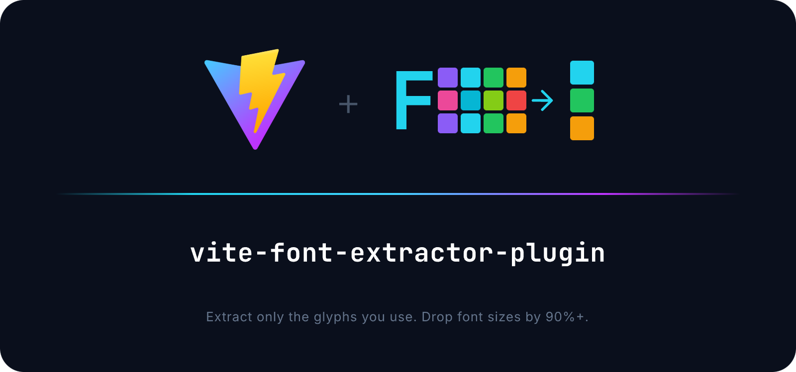

<p align="center">
  
</p>

<p align="center">
  
  
  
  
</p>

# vite-font-extractor-plugin

Vite plugin that **extracts only the glyphs you use** from font files — icon fonts, text fonts, or both — and emits
them under content-hashed names, so they and every file that loads them can be cached forever. Requires Vite 8.

```
Before:  Material Icons   348 KB (all 2,000+ icons)
After:   Material Icons    12 KB (only 3 icons you need)   → 97% smaller
```

## Goal

This is the outcome the plugin exists for, and every change is measured against it:

- **Smaller fonts** — each font keeps only the glyphs the project needs.
- **A new name for everything that changed** — when the minified result differs (another glyph set, another font
  file, other options), the font and every file that depends on it (CSS, JS, HTML preloads, manifest) get new
  content-hashed names. Nothing needs revalidation, nothing on a CDN needs invalidation.
- **The old name for everything that did not change** — when the result is the same, every file keeps its name, so
  browser and CDN caches keep working.

Since 4.0 fonts are minified before the bundler hashes the output: Vite and Rolldown name the minified font, the CSS
that loads it, the JS chunk that imports that CSS or the font, and write the new names into HTML and the manifest
themselves. See [Long-term caching](#long-term-caching).

## Features

- **Cache-friendly file names** — a changed font renames the font and every CSS/JS file that loads it; an unchanged
  build keeps every name ([details](#long-term-caching))
- **Icon font minification** — keep only the ligatures you use (Material Icons and other ligature icon fonts)
- **Text font subsetting** — keep only specific characters via `?subset=` query or target options
- **Zero-config auto mode** — detects glyphs from CSS `content: "..."` of the whole build
- **Google Fonts optimization** — appends the `text=` parameter for server-side subsetting
- **Works in build and dev** — minifies fonts on-the-fly during development, including JS `?subset=` imports
- **Respects your build config** — `assetFileNames`, `base`, `cssCodeSplit`, `assetsInlineLimit`, `build.lib`,
  manifest, HTML preloads, SSR builds
- **[Live playground](https://a3mitskevich.github.io/vite-font-extractor-plugin/)** — see the plugin in action
- **Disk cache** — skip re-minification on repeated builds

## Quick Start

```bash
npm install vite-font-extractor-plugin
```

### Zero-config (auto mode)

```js
// vite.config.js
import FontExtractor from 'vite-font-extractor-plugin'

export default defineConfig({
    plugins: [FontExtractor()],
})
```

The plugin scans all CSS for `content: "..."` declarations, collects referenced glyphs, and strips everything else from
font files:

- single and double quotes, escapes with 1–6 hex digits (`"\e5cd"`, `"\1F600"`), several glyphs in one value and
  literal characters are read; `counter()` / `attr()` are ignored
- a plain word such as `content: "close"` is treated as a ligature
- glyphs the font doesn't contain (e.g. `content: "/"` of a breadcrumb, an emoji) are skipped with an info message;
  a font without any matching glyph is kept original with a warning — add such fonts to `ignore`
- glyphs come from every stylesheet of the build, lazy chunks and CSS modules included: the stylesheet with the
  `@font-face` waits until the rest of the module graph is transformed before its font is minified

Auto mode keeps glyphs reachable through ligatures (Material Icons style). For icon fonts addressed only by code
points use `manual` mode with `unicodeRanges` or `raws`.

### Manual mode

Specify exactly which icons to keep:

```js
FontExtractor({
    type: 'manual',
    targets: [
        {
            fontName: 'Material Icons',
            ligatures: ['close', 'menu', 'search', 'home'],
        },
    ],
})
```

A ligature the font does not have (a typo, an icon of another set) fails the minification of that font: it keeps its
original file and the reason is logged.

## Text Font Subsetting

Strip unused characters from text fonts like Roboto, Inter, or Open Sans.

### Via CSS `?subset=` query

```css
/* Keep only Latin letters and digits */
@font-face {
    font-family: 'Roboto';
    src: url('./fonts/Roboto.woff2?subset=ABCDEFGHIJKLMNOPQRSTUVWXYZabcdefghijklmnopqrstuvwxyz0123456789') format('woff2');
}

/* Keep a Unicode range (e.g. Cyrillic) */
@font-face {
    font-family: 'Roboto';
    src: url('./fonts/Roboto.woff2?subset=U+0400-04FF') format('woff2');
}

/* Combine characters and Unicode ranges */
@font-face {
    font-family: 'Roboto';
    src: url('./fonts/Roboto.woff2?subset=ABC,U+0400-04FF') format('woff2');
}
```

The value is a comma-separated list of characters and `U+` ranges (any case). Percent-encoding is decoded, so
`%20` requests a space and `%2C` a literal comma. `?subset=` works in build and dev, with or without a target —
characters of a target are merged with the query. In auto mode an explicit `?subset=` replaces the detected
glyphs of that `@font-face`. The query is removed from the url of the minified font; other params (`?v=2`) stay.

### Via JS import

Useful for runtime font loading (Rive, Canvas, PDF generators):

```js
import fontUrl from './fonts/Roboto.woff2?subset=ABCabc'

// fontUrl is a clean URL to the subsetted font asset
rive.load({fonts: [fontUrl]})

// new URL() works the same way
const url = new URL('./fonts/Roboto.woff2?subset=ABCabc', import.meta.url)
```

Both forms are minified in build and dev. A JS import **without** `?subset=` loads the original file: it is not tied
to a `font-family`, so no target applies to it.

### Via plugin config

```js
FontExtractor({
    type: 'manual',
    targets: [
        {
            fontName: 'Roboto',
            characters: 'ABCabc0123456789 ', // a space keeps the space glyph
            engine: 'subset', // required for `characters`
        },
    ],
})
```

## Google Fonts

The plugin appends `text=` to Google Font URLs, letting Google's servers do the subsetting:

```html
<link href="https://fonts.googleapis.com/icon?family=Material+Icons" rel="stylesheet">
```

```css
@import "https://fonts.googleapis.com/icon?family=Material+Icons";
```

`text=` lists the `ligatures`, `raws` and `characters` of the family's target; in auto mode it lists the glyphs found
in CSS `content`. `<link>` attributes may come in any order and the HTML may be minified. Supported are the legacy
multi-family form `family=Material+Icons|Roboto` and the css2 API with several `family=` parameters and axes
(`family=Roboto:wght@400;700`).

**Dev server, auto mode:** Google Fonts urls are left without `text=` for families that use auto-detected glyphs —
the browser loads the full Google font. The dev server transforms the HTML before any stylesheet and serves a
stylesheet as it transformed it, so a `text=` built from the glyphs known at that moment would miss the icons of
stylesheets that load later. Families with a target keep their `text=` in dev; the build always adds it.

## Build Output

- Minified fonts are emitted through the bundler like any Vite asset, so `build.rolldownOptions.output.assetFileNames`
  (string or function) names them, `base`, `experimental.renderBuiltUrl` and relative bases apply, and the manifest
  lists them under their source paths.
- An `@font-face` written in a stylesheet is minified before Vite processes the stylesheet: Vite never emits the
  original font for it. An `@font-face` that reaches a stylesheet from a Sass/Less partial, a mixin or `@import`
  is minified right after Vite compiled it: the original Vite emitted for it is removed from the bundle once nothing
  loads it.
- `<link rel="preload">` of a font in HTML follows the file the CSS loads. When several families minify one file
  differently, the preload keeps the original file.
- A JS import without `?subset=` loads the original file (see [Via JS import](#via-js-import)).
- A font file shared by several `font-family` rules is minified per family options. A family without its own target
  keeps pointing at the full original file.
- Fonts Vite inlines as `data:` URLs (`build.lib`, `build.assetsInlineLimit`) are minified and inlined: the rule Vite
  applies to the original file decides.
- SSR builds minify the same way, so an SSR bundle points at the fonts the client build emits (minification is
  deterministic). In auto mode each build collects the glyphs of its own stylesheets: when the SSR build sees other
  CSS than the client, its auto fonts get other names — take font urls for preloads from the client build.
- Fonts in `public/` are copied as is and are not processed.
- `.otf` can't be written by the minifier — other formats of the `@font-face` are minified and the `.otf` is kept
  original with a warning. A font available only as `.eot` is kept original too. The subset engine does not write
  SVG fonts: an `.svg` source of a `?subset=` face stays original.

## Long-term caching

Minified fonts, and the CSS and JS files that load them, can be served with
`Cache-Control: public, max-age=31536000, immutable` and never invalidated on a CDN: new content always comes under a
new file name.

- Fonts are minified during the build, before Rolldown renders and hashes the output. The CSS is rendered with the
  name of the minified font and hashed with it; Vite hashes the names of a chunk's CSS into the JS chunk that imports
  it; HTML and the manifest are written with the new names.
- Minification is deterministic: the same fonts and options give byte-identical files, so a rebuild without changes
  keeps every name, with or without the [cache](#caching).

| Change between builds                                                          | Font         | CSS / JS that load it |
|--------------------------------------------------------------------------------|--------------|-----------------------|
| An icon added or removed, new `characters` / `unicodeRanges` / `?subset=`, new CSS `content` in auto mode | New name     | New name              |
| The font file replaced                                                         | New name     | New name              |
| Nothing changed                                                                | Same name    | Same name             |

- The name carries a hash only when `assetFileNames` has `[hash]` (Vite's default `assets/[name]-[hash][extname]`
  does). With `[name][extname]` a minified font keeps the file name of its source, except where two files would get
  one name: an `@font-face` from a Sass/Less partial, a mixin or `@import` (Vite named the original first), or two
  different results of one file (families with different options, a JS import of the original) — one of them gets the
  next free name (`icons2.woff2`).

## Known limitations

- **Two passes over CSS.** In Vite 8 a CSS `url()` never reaches plugin hooks (vitejs/vite#14686), so an
  `@font-face` from a Sass/Less partial, a mixin or `@import` is handled after Vite compiled the stylesheet: the
  plugin looks up the source file among the files the stylesheet imports. A path built by interpolation
  (`url("#{$dir}/icons.woff2")`) may not be found — the face keeps its original and a warning names it. With
  `assetFileNames` without `[hash]` such a face gets a numbered name (`icons2.woff2`).
- **Auto mode waits for the module graph.** The stylesheet with the `@font-face` is minified after every other module
  of the build is transformed. The plugin listens to every parsed module to know that (20–30 µs per module), and
  a plugin that loads that stylesheet itself would hold the build until a 20-second watchdog — the build then fails
  with the glyphs it missed instead of shipping broken icons. A chunk another plugin emits (`this.emitFile`) joins the
  graph only when it loads: glyphs its stylesheets bring after a font was emitted fail the build the same way — add
  them to a target of the font.
- **Auto mode and SSR.** Each build collects the glyphs of its own stylesheets; an SSR build that sees other CSS than
  the client gets other auto fonts.
- **Fonts outside `@font-face` stay original:** JS imports without `?subset=`, and a preload of a file several
  families minify differently.
- **Not processed:** fonts in `public/`, `.otf` output, eot-only faces, SVG output of the subset engine, remote
  `@font-face` sources. Auto mode sees only CSS `content`, not glyphs used in HTML or JS.
- **Vite internals:** the plugin relies on Vite 8 details that are not public API — the `__VITE_ASSET__` placeholder
  of CSS, and `transformIndexHtml` (post) running before HTML asset placeholders are resolved. The test suite covers
  them; a Vite minor that changes them needs a plugin update.

## Caching

Enable disk cache to skip re-minification when fonts and config haven't changed:

```js
FontExtractor({
    type: 'manual',
    targets: [{fontName: 'Material Icons', ligatures: ['close']}],
    cache: true,              // caches in <cacheDir>/.font-extractor-cache (node_modules/.vite by default)
    // cache: './my-cache',   // or in ./my-cache/.font-extractor-cache
})
```

Cache entries are keyed by the font file content, the target options and the version of fontext, so replacing a font
file or upgrading the minifier never returns a stale result. Every build of a config and every dev server records the
entries it used; after a build, entries no build or dev server used within 30 days are removed, so two configs of one
project and a running dev server keep their entries. When `cache` is disabled, the default cache directory (and the
`node_modules/.font-extractor-cache` of 3.x) is removed; a custom cache path is left as is.

## Vite Compatibility

| Plugin | Vite         | Node        |
|--------|--------------|-------------|
| 4.x    | 8            | ≥ 22.13     |
| 3.x    | 5, 6, 7, 8   | ≥ 20        |

The plugin runs in every build environment (client, SSR) and serves minified fonts to the browser in dev.

## Migrating from 3.x

- **Vite 8 and Node 22.13+ are required.** Stay on 3.x for Vite 5–7.
- **`FontExtractor()` returns an array of plugins.** `plugins: [FontExtractor()]` keeps working; code that reads
  properties of the returned object (e.g. `.name`) has to handle an array.
- **CSS and JS that load a font are renamed with it.** If you served CSS/JS with revalidation because 3.x did not
  rename them, you can switch them to `immutable`.
- **`withWhitespace` is removed** (fontext 2 dropped it). A target that sets it fails with a hint: add `" "` to
  `characters` of a subset target; the icon engine never keeps a space glyph.
- **A ligature the font does not have fails the font** (fontext 2): the font keeps its original file and the reason is
  logged. Check the log for `Failed to minify`.
- **JS imports without `?subset=` load the original file.** 3.x pointed them at the result of an `@font-face` of the
  same file; add `?subset=` to minify a font imported from JS.
- **Fonts Vite inlines are minified and inlined**, instead of being left out with a warning.
- **The disk cache moved** from `node_modules/.font-extractor-cache` to `<config.cacheDir>/.font-extractor-cache`
  (`node_modules/.vite` by default). The old directory can be deleted; a build with `cache` disabled deletes it.
- **SSR builds are minified** and point at the fonts of the client build instead of the originals.
- **`?subset=` works in `new URL()`**, and JS `?subset=` imports are minified by the dev server.
- **Google Fonts `text=`** also lists `characters`/`raws` of targets and, in auto mode, the detected glyphs.

## API Reference

```typescript
import FontExtractor from 'vite-font-extractor-plugin'

FontExtractor(options?: PluginOption): Plugin[]
```

### PluginOption

| Option     | Type                                      | Default     | Description                               |
|------------|-------------------------------------------|-------------|-------------------------------------------|
| `type`     | `'auto' \| 'manual'`                      | see below   | Glyph detection strategy                  |
| `targets`  | `Target \| Target[]`                      | —           | Fonts to process. Required in manual mode |
| `cache`    | `boolean \| string`                       | —           | Enable disk cache (or custom path)        |
| `logLevel` | `'info' \| 'warn' \| 'error' \| 'silent'` | Vite config | Log verbosity                             |
| `apply`    | `'build' \| 'serve'`                      | both        | Restrict to build or dev mode             |
| `ignore`   | `string[]`                                | —           | Font names to skip entirely               |
| `report`   | `string`                                  | —           | Build: write a JSON report of the fonts   |

- `type`: `FontExtractor()` without arguments runs in `auto` mode. An options object without `type` falls back to
  `manual` and logs a warning — set `type` explicitly.
- `logLevel` has no effect when Vite runs with a `customLogger`: messages go to that logger unfiltered.
- `ignore` also applies to `@font-face` rules with `?subset=`.
- `report`: see [Build report](#build-report).

### Build report

`report: 'font-report.json'` makes every build write a JSON report of its fonts. The path is relative to the output
directory (`build.outDir`) or absolute. The report is emitted as an asset of the bundle, so it is part of
`build.write: false` results too; it is not a font, so the manifest does not list it. Each build environment (client,
SSR) and each output writes its own report; an absolute path outside the output directory is written as it is.

```json
{
  "version": "4.0.0",
  "mode": "manual",
  "environment": "client",
  "fonts": [
    {
      "fontName": "Material Icons",
      "source": "src/fonts/material-icons.woff2",
      "format": "woff2",
      "output": "assets/material-icons-DKVKbtPS.woff2",
      "originalSize": 124404,
      "minifiedSize": 652,
      "cached": false,
      "glyphs": { "ligatures": ["close"] }
    }
  ],
  "skipped": [
    { "fontName": "Roboto", "source": "src/fonts/roboto.woff2", "reason": "minification failed: …" }
  ],
  "totals": { "originalSize": 124404, "minifiedSize": 652, "saved": 123752 }
}
```

- `fonts`: one entry per minified file in the output, sorted by `fontName`, `source` and `format`; `source` is
  relative to the root, `output` is the file name, or `"inline"` for a font inlined as a `data:` URL. `cached` tells
  whether the result came from the [disk cache](#caching). `glyphs` are the `ligatures`, `raws`, `characters` and
  `unicodeRanges` the font was minified with (target and `?subset=`); in auto mode `raws` lists every glyph found in
  CSS `content`, those the font does not have are left out of the font.
- `skipped`: fonts kept original, with the reason (minification failed, no smaller result, source of a compiled
  `@font-face` not found).
- The same build writes the same report, apart from `cached`.

### Target

| Option           | Type                 | Description                                              |
|------------------|----------------------|----------------------------------------------------------|
| `fontName`       | `string`             | Must match `font-family` in CSS (without quotes)         |
| `ligatures`      | `string[]`           | Icon names to keep (e.g. `['close', 'menu']`)            |
| `raws`           | `string[]`           | Raw Unicode characters to keep                           |
| `characters`     | `string`             | Characters to keep; requires `engine: 'subset'`          |
| `unicodeRanges`  | `string[]`           | Unicode ranges (e.g. `['U+0400-04FF']`)                  |
| `engine`         | `'icon' \| 'subset'` | `icon` for icon fonts (default), `subset` for text fonts |
| `safariFix`      | `boolean`            | Align vertical metrics for Safari rendering              |
| `silent`         | `boolean`            | Suppress minifier output for this font                   |

## Troubleshooting

**Font not being minified?**

- Check that `fontName` exactly matches the `font-family` value in your CSS `@font-face` (without quotes)
- Make sure the font isn't in the `ignore` list
- The reason of a failed minification is printed after `Failed to minify "<font>" — keeping original:`
- A font imported from JS without `?subset=` is loaded as is — see [Via JS import](#via-js-import)

**Warning: "has no minify options"?**

- The plugin found a `@font-face` but the font isn't in `targets`
- Fonts with `?subset=` URLs don't trigger this warning — they're processed automatically
- To silence: add the font to `targets`, use `?subset=`, or add to `ignore`

**Error: "auto mode: CSS content … was found after its font had been emitted"?**

- Auto mode could not wait for every stylesheet before the font was minified — usually a plugin that loads the
  stylesheet with the `@font-face` from another module. Add the listed glyphs to a target of the font (auto mode uses
  a target when one is given) and report the setup in an issue

**Google Font URL not transformed?**

- Use spaces in `fontName`: `'Material Icons'`, not `'Material+Icons'`

**Auto mode missing glyphs?**

- Auto mode only detects glyphs from CSS `content: "..."` properties
- If icons are referenced by class name or JS, use `manual` mode instead

## License

[MIT](./LICENSE)

## Contributing

Issues and pull requests are welcome on [GitHub](https://github.com/a3mitskevich/vite-font-extractor-plugin).
